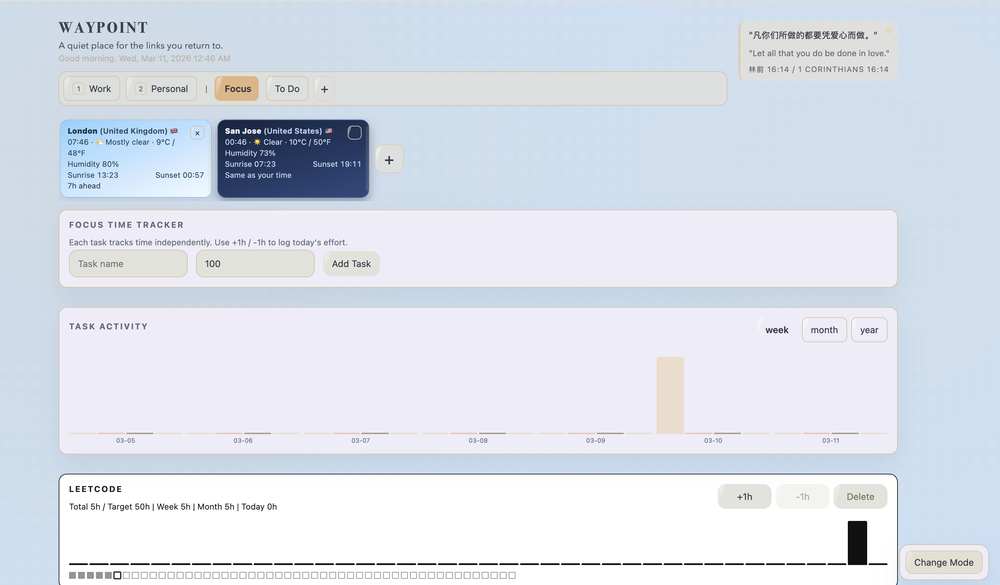
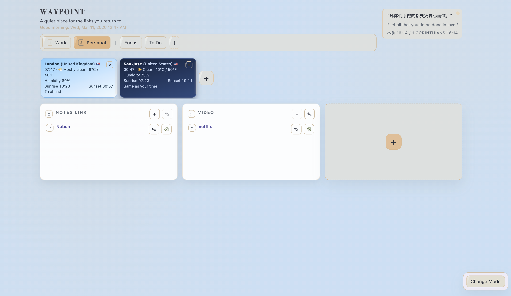

# LinkDash
# WAYPOINT  
### A quiet place for the links you return to.


Waypoint is a lightweight **personal dashboard and productivity hub** designed for focus, quick access, and daily tracking.

Instead of switching between multiple tools, Waypoint brings everything into **one calm workspace** — your links, focus tracking, activity visualization, and personal shortcuts.

---

## Overview





Waypoint transforms your browser into a **clean productivity environment** where you can organize your resources and track how you spend your time.

---

## Key Features

### Personal Link Dashboard

Organize the websites you use every day in one place.

- Create **custom link categories**
- Add **unlimited links**
- **Drag & drop** to rearrange sections
- Clean grid layout for quick navigation
- Perfect for tools, notes, research, or entertainment

**Example categories:**

- Work
- Personal
- Notes
- Video
- Learning

Everything stays visible and easy to access.

---

### Focus Time Tracker

Track how much time you spend on meaningful work.

- Create tasks instantly
- Log time with `+1h / -1h`
- Track **daily progress**
- Set **targets for tasks**
- Visualize your effort over time

Waypoint automatically generates **activity charts** so you can review your productivity:

- Daily activity
- Weekly progress
- Monthly overview
- Yearly trends

You can also **export your focus data** for personal tracking or review.

---

### Activity Visualization

Your work becomes visible.

Waypoint converts your focus time into **simple visual charts** so you can quickly see:

- when you were productive
- how your effort changes over time
- how close you are to your goals

Switch views between:

- Week
- Month
- Year

---

### Visual Modes

Waypoint includes **multiple visual themes** so you can customize the look and feel of your workspace.

- Different color modes
- Calm visual palette
- Designed for long working sessions

You can choose the style that feels the most comfortable for you.

---

### Customizable Background

Create an environment that helps you focus.

Waypoint allows you to:

- customize the background
- create a calm workspace
- reduce visual stress while working

The interface is designed to feel **soft, quiet, and distraction-free**.

---

### Weather & Context

Quickly check the conditions in cities you care about.

Add locations to see:

- local time
- temperature
- humidity
- sunrise / sunset

Useful when working across **different regions or time zones**.

---

## Browser Extension

Waypoint also works as a **browser extension**, turning your new tab page into a personal productivity dashboard.

Every new tab becomes:

- your focus center
- a quick link hub
- a progress tracker

Instead of opening a blank page, you open **your workspace**.

## Build As Chrome Extension (New Tab)

1. Build extension package:

```bash
npm run build:ext
```

2. Open `chrome://extensions`.
3. Enable `Developer mode`.
4. Click `Load unpacked`.
5. Select folder: `extension-dist`.
6. Pin the extension and click its toolbar icon to open LinkDash in a tab.

This extension no longer overrides your default new tab page.
It runs with local browser storage in extension mode, so it does not require the Node/SQLite server.

# React + Vite

This template provides a minimal setup to get React working in Vite with HMR and some ESLint rules.

Currently, two official plugins are available:

- [@vitejs/plugin-react](https://github.com/vitejs/vite-plugin-react/blob/main/packages/plugin-react) uses [Babel](https://babeljs.io/) (or [oxc](https://oxc.rs) when used in [rolldown-vite](https://vite.dev/guide/rolldown)) for Fast Refresh
- [@vitejs/plugin-react-swc](https://github.com/vitejs/vite-plugin-react/blob/main/packages/plugin-react-swc) uses [SWC](https://swc.rs/) for Fast Refresh

## React Compiler

The React Compiler is currently not compatible with SWC. See [this issue](https://github.com/vitejs/vite-plugin-react/issues/428) for tracking the progress.

## Expanding the ESLint configuration

If you are developing a production application, we recommend using TypeScript with type-aware lint rules enabled. Check out the [TS template](https://github.com/vitejs/vite/tree/main/packages/create-vite/template-react-ts) for information on how to integrate TypeScript and [`typescript-eslint`](https://typescript-eslint.io) in your project.
